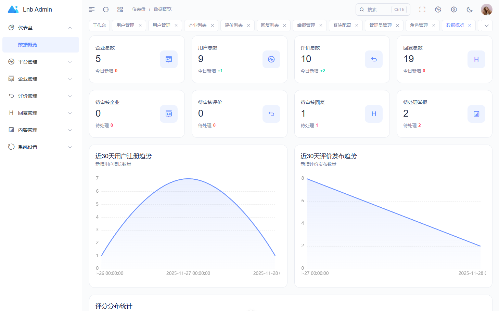
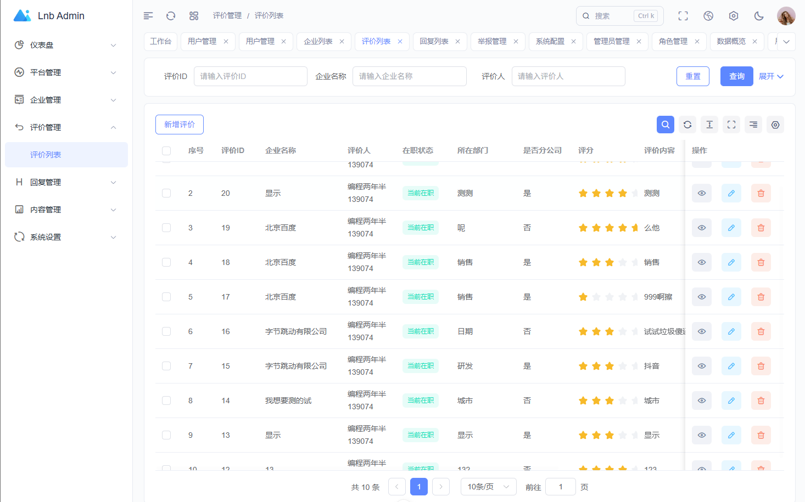
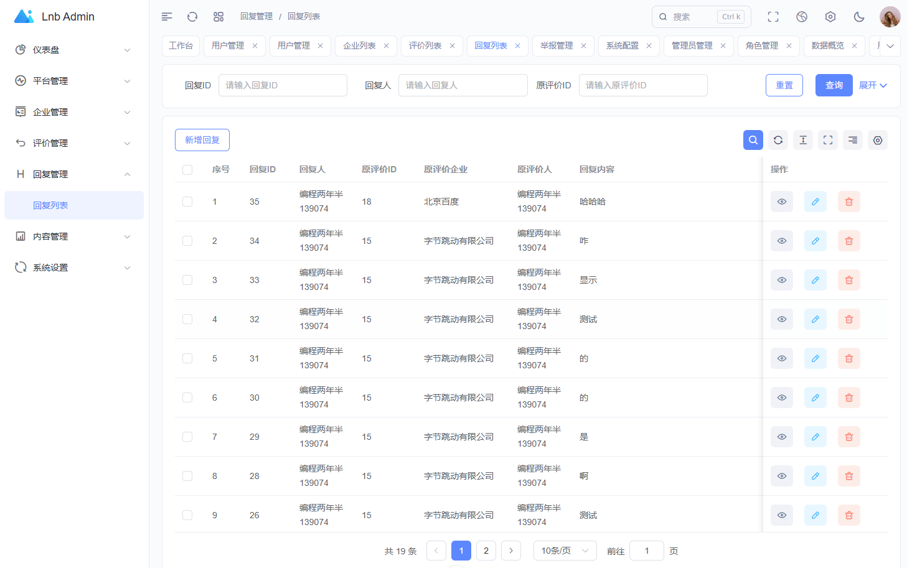
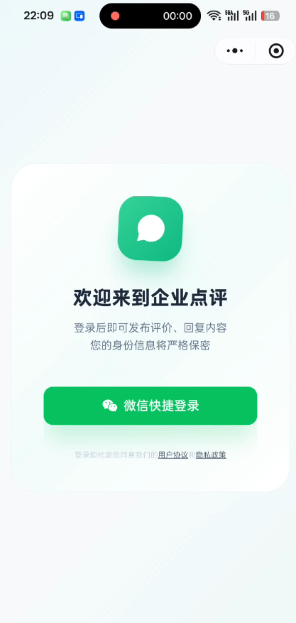
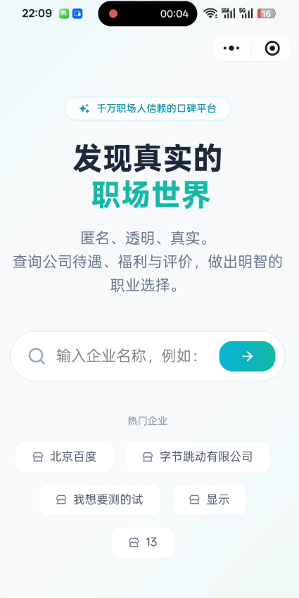
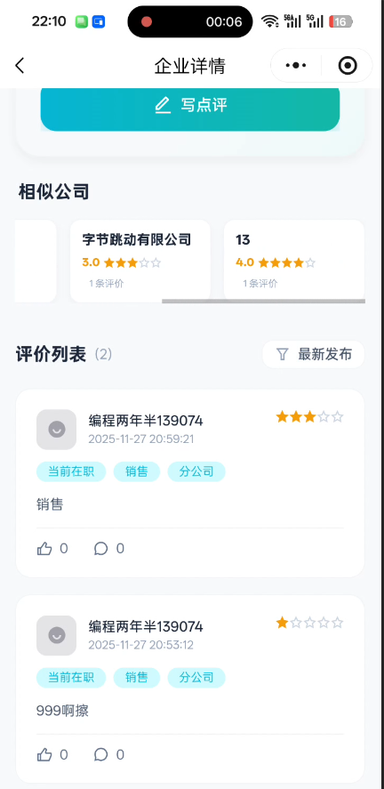
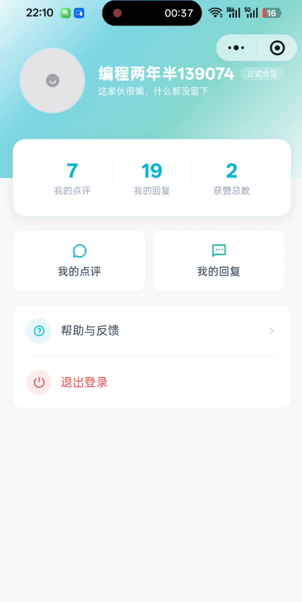

# 企业点评系统 (Enterprise Rating System)

一个完整的企业点评平台，包含后台管理系统、小程序端和后端接口服务。

## 📋 项目概述

本项目是一个全栈企业点评系统，用户可以对企业进行评价、评分、发表评论等。系统包含三个主要部分：

- **Admin** - 后台管理系统（Vue 3 + Vite）
  - 基于 [lnb-admin](https://github.com/yourusername/lnb-admin) 开源框架开发
- **Cool-Unix-Main** - 小程序端（UniApp）
  - 基于 [Cool-Vue](https://github.com/cool-team-official/cool-vue) 开源框架开发
- **Server** - 后端接口服务（Node.js + Express）

## 📸 项目演示

### 后台管理系统





### 小程序端






## 📁 项目结构

```
qiyedianpin/
├── admin/                    # 后台管理系统
│   ├── src/
│   │   ├── components/      # Vue组件
│   │   ├── pages/           # 页面
│   │   ├── stores/          # Pinia状态管理
│   │   ├── router/          # 路由配置
│   │   ├── api/             # API接口调用
│   │   ├── utils/           # 工具函数
│   │   └── App.vue          # 根组件
│   ├── package.json
│   └── vite.config.ts
│
├── cool-unix-main/          # 小程序端
│   ├── pages/               # 页面
│   ├── components/          # 组件
│   ├── common/              # 通用模块
│   ├── config/              # 配置文件
│   ├── cool/                # Cool框架模块
│   ├── uni_modules/         # UniApp模块
│   ├── package.json
│   └── vite.config.ts
│
├── server/                  # 后端接口服务
│   ├── src/
│   │   ├── controllers/     # 控制器
│   │   ├── services/        # 业务逻辑
│   │   ├── routes/          # 路由定义
│   │   ├── middlewares/     # 中间件
│   │   └── utils/           # 工具函数
│   ├── scripts/             # 初始化脚本
│   ├── config/              # 配置文件
│   ├── package.json
│   ├── server.js            # 服务器入口
│   └── .env                 # 环境变量
│
└── README.md                # 项目说明文档
```

## 🛠 技术栈

### Admin（后台管理系统）

| 技术 | 版本 | 说明 |
|------|------|------|
| Vue | 3.5.12 | 前端框架 |
| Vite | 6.1.0 | 构建工具 |
| TypeScript | 5.6.3 | 类型检查 |
| Element Plus | 2.10.2 | UI组件库 |
| Pinia | 3.0.2 | 状态管理 |
| Vue Router | 4.4.2 | 路由管理 |
| Axios | 1.7.5 | HTTP客户端 |
| ECharts | 5.6.0 | 数据可视化 |
| TailwindCSS | - | CSS框架 |

### Cool-Unix-Main（小程序端）

| 技术 | 版本 | 说明 |
|------|------|------|
| Vue | 3.5.13 | 前端框架 |
| UniApp | - | 跨平台框架 |
| Vite | 6.3.5 | 构建工具 |
| TailwindCSS | 3.4.17 | CSS框架 |
| TypeScript | - | 类型检查 |

### Server（后端服务）

| 技术 | 版本 | 说明 |
|------|------|------|
| Node.js | >=16.0.0 | 运行环境 |
| Express | 4.18.2 | Web框架 |
| MySQL | - | 数据库 |
| Redis | 4.6.10 | 缓存服务 |
| JWT | 9.0.2 | 身份认证 |
| bcrypt | 5.1.1 | 密码加密 |
| Multer | 1.4.5 | 文件上传 |
| 七牛云 | 7.8.0 | 对象存储 |

## 🚀 快速开始

### 前置要求

- Node.js >= 16.0.0
- MySQL >= 5.7
- Redis >= 5.0
- npm 或 pnpm

### 环境配置

#### 1. 克隆项目

```bash
git clone https://github.com/yourusername/qiyedianpin.git
cd qiyedianpin
```

#### 2. 后端服务配置

```bash
cd server

# 安装依赖
npm install

# 配置环境变量 - 编辑 .env 文件
# 参考下面的环境变量说明部分

# 初始化数据库
npm run init-db

# 初始化测试数据（可选）
npm run init-data

# 启动开发服务器
npm run dev

# 或启动生产服务器
npm start
```

#### 3. 后台管理系统配置

```bash
cd admin

# 安装依赖
npm install

# 启动开发服务器
npm run dev

# 构建生产版本
npm run build
```

#### 4. 小程序端配置

```bash
cd cool-unix-main

# 安装依赖
npm install

# 启动开发服务器
npm run dev

# 构建生产版本
npm run build
```

## 🔧 环境变量配置

### Server 环境变量 (.env)

```env
# 服务器配置
PORT=3000                                    # 服务器端口
NODE_ENV=development                         # 运行环境：development/production

# Redis配置
REDIS_HOST=127.0.0.1                        # Redis主机地址
REDIS_PORT=6379                             # Redis端口
REDIS_PASSWORD=                             # Redis密码（如果有）

# 数据库配置
DB_HOST=localhost                           # 数据库主机地址
DB_PORT=3306                                # 数据库端口
DB_USER=输入你的数据库用户名                 # 数据库用户名
DB_PASSWORD=输入你的数据库密码               # 数据库密码
DB_NAME=输入你的数据库名称                   # 数据库名称

# JWT配置
JWT_SECRET=输入你的JWT密钥                   # JWT密钥
JWT_EXPIRES_IN=7d                           # Token过期时间
JWT_MOBILE_SECRET=输入你的移动端JWT密钥      # 移动端JWT密钥
JWT_ADMIN_SECRET=输入你的后台JWT密钥         # 后台JWT密钥

# 微信小程序配置
WECHAT_APPID=输入你的微信AppID              # 微信小程序AppID
WECHAT_APPSECRET=输入你的微信AppSecret      # 微信小程序AppSecret

# 七牛云配置（可选）
QINIU_ACCESS_KEY=输入你的七牛AccessKey      # 七牛云AccessKey
QINIU_SECRET_KEY=输入你的七牛SecretKey      # 七牛云SecretKey
QINIU_BUCKET=输入你的七牛Bucket名称         # 七牛云Bucket
QINIU_DOMAIN=输入你的七牛域名                # 七牛云域名
```

### Admin 环境变量 (.env)

```env
VITE_API_BASE_URL=http://localhost:3000     # 后端API地址
VITE_APP_TITLE=企业点评系统                  # 应用标题
```

### Cool-Unix-Main 环境变量

在 `config/` 目录下配置API地址和其他参数。

## 📱 功能特性

### 后台管理系统 (Admin)

- ✅ 用户管理
- ✅ 企业管理
- ✅ 评价管理
- ✅ 评论管理
- ✅ 数据统计
- ✅ 权限管理
- ✅ 系统设置

### 小程序端 (Cool-Unix-Main)

- ✅ 企业浏览
- ✅ 企业搜索
- ✅ 发表评价
- ✅ 评价列表
- ✅ 用户中心
- ✅ 我的评价

### 后端服务 (Server)

- ✅ RESTful API
- ✅ JWT身份认证
- ✅ 权限控制
- ✅ 数据验证
- ✅ 错误处理
- ✅ 日志记录
- ✅ Redis缓存

## 🐳 Docker 部署

### 使用 Docker Compose

```bash
# 启动所有服务
docker-compose up -d

# 停止所有服务
docker-compose down

# 查看日志
docker-compose logs -f
```

## 🏢 宝塔面板部署

### 后端服务部署

1. **登录宝塔面板**
   - 访问宝塔面板地址
   - 输入用户名和密码

2. **创建Node.js项目**
   - 点击"应用商店" → 搜索"Node.js"
   - 安装Node.js和PM2
   - 创建新的Node.js项目

3. **配置项目**
   - 项目路径：选择server目录
   - 启动文件：`server.js`
   - 端口：3000
   - 自动启动：勾选

4. **配置环境变量**
   - 在宝塔面板中编辑 `.env` 文件
   - 配置数据库、Redis等信息

5. **安装依赖**
   ```bash
   cd /path/to/server
   npm install
   npm run init-db
   ```

6. **启动服务**
   - 在宝塔面板中点击"启动"按钮
   - 或使用命令：`pm2 start server.js --name qiyedianpin-server`

### 前端项目部署

1. **构建项目**
   ```bash
   # Admin
   cd admin
   npm run build
   
   # Cool-Unix-Main
   cd cool-unix-main
   npm run build
   ```

2. **上传文件**
   - 将构建后的 `dist` 文件夹上传到宝塔面板
   - 配置Nginx反向代理

3. **配置Nginx**
   ```nginx
   server {
       listen 80;
       server_name yourdomain.com;
       
       location / {
           root /path/to/admin/dist;
           try_files $uri $uri/ /index.html;
       }
       
       location /api {
           proxy_pass http://localhost:3000;
       }
   }
   ```

## 📚 API文档

详见各模块的API文档：

- [Server API文档](./server/docs/API.md)
- [Admin开发文档](./admin/docs/)
- [小程序开发文档](./cool-unix-main/docs/)

## 🔐 安全建议

1. **生产环境必须修改以下内容：**
   - 数据库用户名和密码
   - JWT密钥
   - 微信小程序AppID和AppSecret
   - 七牛云AccessKey和SecretKey

2. **启用HTTPS**
   - 在宝塔面板中配置SSL证书

3. **设置防火墙规则**
   - 只允许必要的端口访问
   - 限制数据库端口访问

4. **定期备份**
   - 备份数据库
   - 备份上传的文件

## 📝 开发规范

### 代码风格

- 使用ESLint进行代码检查
- 使用Prettier进行代码格式化
- 遵循Airbnb JavaScript规范

### Git提交规范

```bash
# 使用commitizen进行提交
npm run commit

# 或直接使用git commit
git commit -m "feat: 添加新功能"
```

### 分支管理

- `main` - 主分支，用于发布版本
- `develop` - 开发分支
- `feature/*` - 功能分支
- `bugfix/*` - 修复分支

## 🤝 贡献指南

欢迎提交Issue和Pull Request！

1. Fork本仓库
2. 创建特性分支 (`git checkout -b feature/AmazingFeature`)
3. 提交更改 (`git commit -m 'Add some AmazingFeature'`)
4. 推送到分支 (`git push origin feature/AmazingFeature`)
5. 开启Pull Request

## 📄 许可证

本项目采用MIT许可证，详见 [LICENSE](./LICENSE) 文件。

## 👥 作者

- 项目维护者：编程两年半
- 邮箱：gjhxue@qq.com
- 微信：bclnb00
- 抖音：编程两年半

## 🙏 致谢

感谢所有贡献者和使用者的支持！

特别感谢以下开源项目：

- [lnb-admin](https://github.com/mituya12/lnb-admin) - 后台管理系统框架
- [Cool-Vue](https://github.com/cool-team-official/cool-vue) - 小程序框架

## 📞 联系方式

- **邮箱**：gjhxue@qq.com
- **微信**：bclnb00
- **抖音**：编程两年半
- **GitHub Issues**：[问题反馈](https://github.com/mituya12/qiyedianpin/issues)
- **Gitee Issues**：[问题反馈](https://gitee.com/get_mt/qiyedianpin/issues)

## 🔗 相关项目

### 前端项目

- **Admin** - 后台管理系统
  - 原始框架：[lnb-admin](https://github.com/mituya12/lnb-admin)
  - 技术栈：Vue 3 + Vite + TypeScript + Element Plus
  - 文档：[admin/README.md](./admin/README.md)

- **Cool-Unix-Main** - 小程序端
  - 原始框架：[Cool-Vue](https://github.com/cool-team-official/cool-vue)
  - 技术栈：UniApp + Vue 3 + TypeScript + TailwindCSS
  - 文档：[cool-unix-main/README.md](./cool-unix-main/README.md)

### 后端项目

- **Server** - 后端接口服务
  - 技术栈：Node.js + Express + MySQL + Redis
  - 文档：[server/README.md](./server/README.md)

---

**最后更新：** 2025年11月28日
